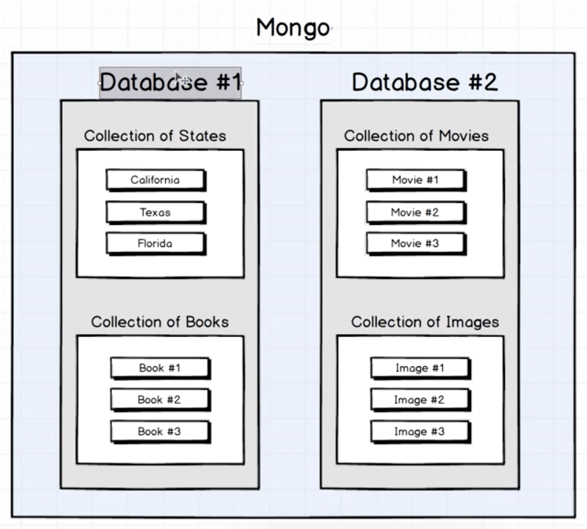
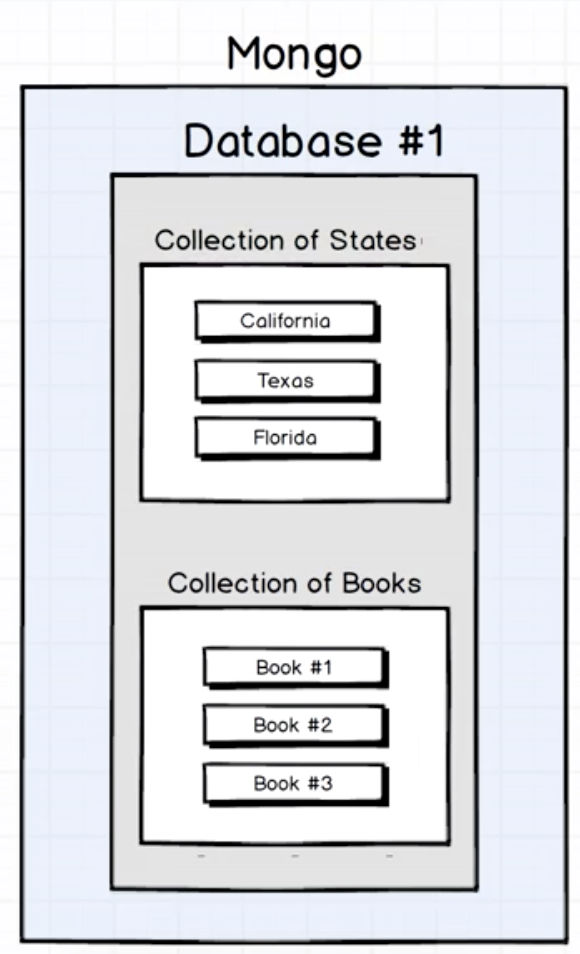
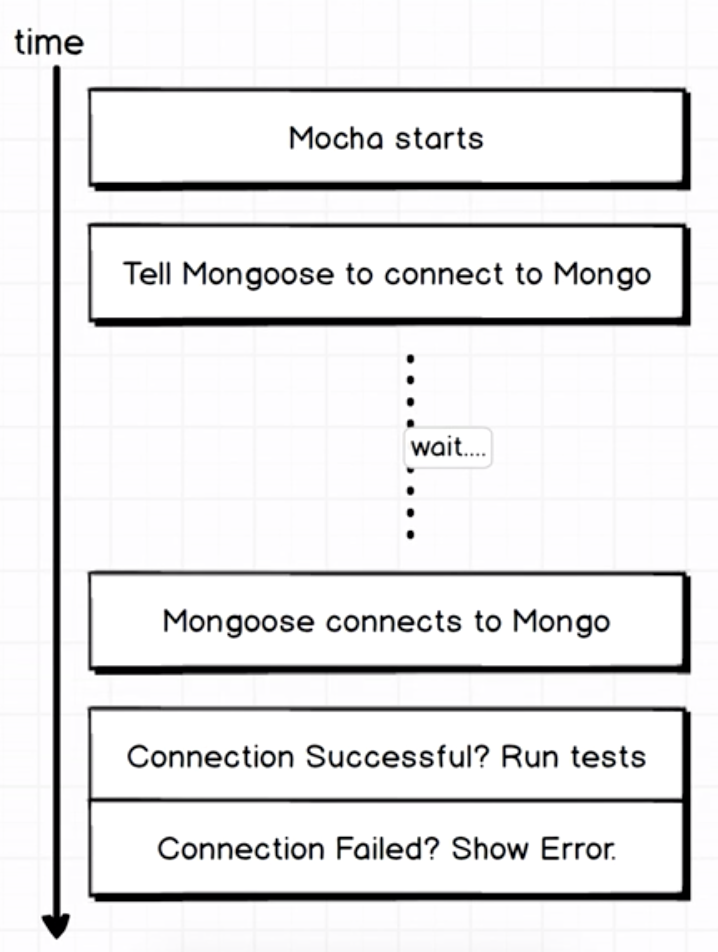
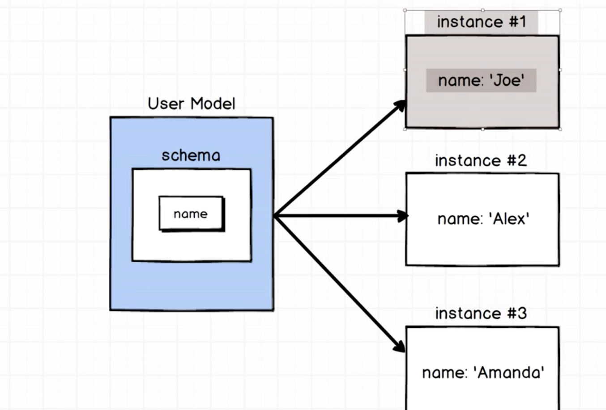

# Mongo db tutorial

Course reference [udemy](https://www.udemy.com/the-complete-developers-guide-to-mongodb/learn/lecture/6035422#overview)

**To start the server:**

`$ mongod`

**To run the server always when the computer start:**

`$ brew services restart mongodb`

---

## 1. Core Fundamentals of MongoDB

---

### **1.1 - Where do we use Mongo:**

Data that we need to persist inside our upp, like todo list, recipes, emails

````
  --- --- --- --- ---         --- --- --- --- ---
|       Browser       |     |      Mobile App     |
  --- --- --- --- ---         --- --- --- --- ---
                    |           |
                    |           |
                  --- --- --- --- ---
                |         Node        |
                  --- --- --- --- ---
                |       Mongoose      |
                  --- --- --- --- ---
                           |
                           |
                  --- --- --- --- ---
                |        Mongo        |
                  --- --- --- --- ---
```
````

### **1. 2. Core concepts:**

Mongo have four operations:

- Crate
- Read
- Update
- Destroy

## Notes:

- You can create more than one database in one instance.
  

- Mongo use collections to make groups of data (represent a single type of resources.).
  

---

## 2. Test driven experience

---

### 2.1 Timeline of mocha test:


First we need to require mongoose, then connect with the mongo database, and finally catch the response of the connection.

### **2.2 Mongoose connection helper:**

`mongoose.connect("mongodb://localhost/user_test");`

**Instance:** _localhost_.

The server address when is running the mongo instance.

**Database:** _user_test_

The database is where we have the collections.

### **2.3 Mongoose models:**

**Models** are higher-order constructors that take a schema and create an instance of a document equivalent to records in a relational database.



**Schema** tells us exactly what properties we expect each record in the collection to have and what type of data we expect it to be.

### **2.4 Mocha basic**

Is a framework running in NodeJS and in the browser. It provides functionality for testing both synchronous and asynchronous code with a very simple and similar interface.

[Read more...](https://mochajs.org/)

**Diagram of structure:**

```
describe
__________
|    ____    |
|   | it |   |
|    ----    |
|    ____    |
|   | it |   |
|    ----    |
|    ____    |
|   | it |   |
|    ----    |
____________
```

**[_describe_]**: It normally describe a test of a function.

It receive two arguments:
String: Describe the test that we're about to write.
Function: The function to write the test

**[_it_]**: Is used to test a specific part of the function

**[_done_]:** Means that the test or the function is ready and can go to the next instruction. Every single block **it** and before each statement, have access to **done**.

You should clear the database each test that you run.

```
 Time circle:
  | Mocha start
  | Empty database
  | Test #1
  | Empty database
  | Test #2
  | Empty database

```

Sometimes we need to use a hook to run every test, so in mocha you use:

​```Javascript
beforeEach(done => {
// Clean the database
mongoose.connection.collections.user.drop(() => {
done();
});
});

````

Int this case we user th hook to clean the user collection before run each test.

---

### 2.5 Making Mongo Queries

---

**_find:_** Find all the users that match the criteria. It returns an array.

```Javascript
User.find({ name: 'Joe' })

/*
  @prarams:

  query       => document (Specifies selection filter).
  projection  => document (Specifies the fields to return).
*/
````

---

### **Finding particular records**

**_find:_** find all the user that match the criteria. Return a list with the found items.

**_findOne:_** find the first user that match the criteria. Return a single record.

> Example: Look the file `reading_test.js`

---

### **Removing records**

**_remove:_** find the record of the collection by the criteria and remove them.

**_findOneAndRemove:_** find the record of a collection by criteria ans remove it.

**_findByIdAndRemove:_** find the record by ID and remove it.

Notes:

- To remove a model of instance we use: `joe.remove()`.
- To remove a model of class we use: `User.remove({ name: 'Joe' })`.
- To remove findOneAndRemove we use `User.findByIdAndRemove({ name: "Joe" })`.
- To remove findByIdAndRemove we use User.findByIdAndRemove(joe.\_id).

> Example: Look the file `deleted_test.js`

---

### **Updating records**

_- Model class methods:_

**_update:_**

**_findOneAndUpdate:_**

**_findByIdAndUpdate:_**

_- Model instance methods:_

**_update:_**

**_set:_** Will update a property of the record.

> `joe.set("name", "Alex");`

**_save:_**

---

35
